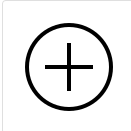
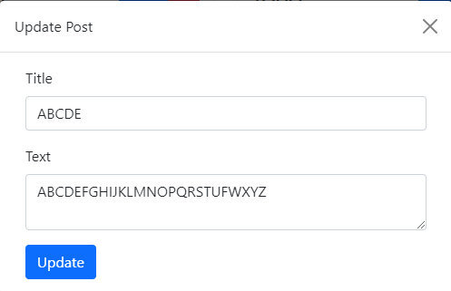
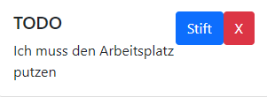

# Intranet Dashboard Modul 120

*Lorenzo Lettieri, Lena Bruggmann*

Die Idee des Dashboards ist, dass man Infos Postet. Man kann es somit als Intranet-Info Seite benutzen.

Wenn man aufs Plus klickt, dann kann man einen neuen Post hinzufügen. Bei dem Post kann man ein Titel und eine
Beschreibung schreiben. Wichtige Events oder generelle Informationen könnte man Posten.

Man kann auch den Titel und der Text vom Post ändern. Nach dem Ändern werden die Posts sofort aktualisiert.

Fürs Bearbeiten auf den Stift klicken.

Fürs Löschen auf das Kreuz klicken.